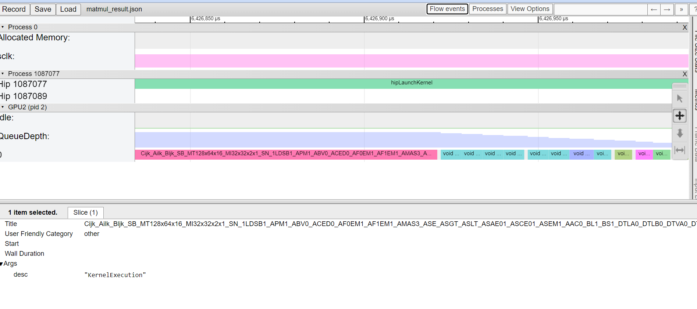

<head>
  <meta charset="UTF-8">
  <meta name="description" content="Unveiling Performance Insights: Profiling and Tracing Applications on AMD GPU with rocmProfileData">
  <meta name="keywords" content="Profiling, Tracing, HPC, HIP, rocmProfileData, AMD, GPU, MI300, MI250, MI210, rocmProfileData">
</head>

# Unveiling Performance Insights: Profiling and Tracing Applications on AMD GPU with rocmProfileData

In this blog, we delve into the capabilities of [rocmProfileData](https://github.com/ROCm/rocmProfileData), a powerful tool developed by AMD for profiling and tracing applications across various programming languages on AMD GPU. Our goal is to equip developers and data scientists with the insights and resources to fully leverage the performance potential of their GPU-accelerated applications in production, using a straightforward code example.

## Introduction

In the dynamic landscape of GPU-accelerated computing, achieving optimal performance and efficiency is key to improve user experience and increase revenue. This pursuit often leads engineers and data scientists to delve into the realms of profiling and tracing, two indispensable techniques for gaining deep insights into the behavior and performance characteristics of applications running on GPUs.

Profiling focuses on analyzing performance metrics to quantify the behavior of the application during execution. By profiling key performance indicators such as execution time, memory usage, and kernel occupancy, developers can pinpoint areas of inefficiency and prioritize optimization efforts. Profiling provides actionable insights into the runtime behavior of the application, guiding developers towards optimizations that yield tangible performance improvements.

Tracing, on the other hand, involves monitoring and recording the sequence of operations performed by an application as it executes on the GPU. This detailed log provides invaluable visibility into the inner workings of the application, allowing developers to understand how data flows through the computation pipeline, identify potential bottlenecks, and optimize algorithmic implementations. Tracing essentially offers a "birds-eye view" of the application's execution, enabling developers to diagnose performance issues and fine-tune their code for maximum efficiency.

The importance of profiling and tracing cannot be overstated in the context of GPU-accelerated computing. As GPUs continue to play a pivotal role in a wide range of applications, specifically generative AI applications serving large models, understanding and optimizing their performance can generate more revenue by improving end user experience and lowering model serving cost. Profiling and tracing empower developers to unlock the full potential of GPU hardware, enabling them to harness its parallel computing power efficiently and effectively.

Developed in-house at AMD by Michael Wootton and his colleagues, [rocmProfileData](https://github.com/ROCm/rocmProfileData) is specifically tailored to profile and trace applications running with ROCm on AMD GPUs. Throughout this blog, we will demonstrate how easily the core functionalities of this package can be executed on a simple code example.

## Environment setup

We run the code example in a PyTorch ROCm 6.02 docker container with an AMD GPU in Ubuntu. For a list of supported OS and AMD hardware refer to [System Requirements](https://rocm.docs.amd.com/projects/install-on-linux/en/latest/reference/system-requirements.html).

Pull and run the docker container with the following code in a Linux shell:

```text
docker run -it --ipc=host --network=host --device=/dev/kfd --device=/dev/dri \
           --group-add video --cap-add=SYS_PTRACE --security-opt seccomp=unconfined \
           --name=blog-rpd602 rocm/pytorch:rocm6.0.2_ubuntu22.04_py3.10_pytorch_2.1.2 /bin/bash
```

You can verify the number of GPUs detected by PyTorch on your machine by executing the following two lines of code in the Python console. If the Docker configuration is correct, the detected number of GPUs should match the number of GPUs installed on your machine.

```python
import torch
torch.cuda.device_count()
```

## Implementation

### Package installation

Install rocmProfileData and other required softwares by running the following commands in your Linux Shell.

```text
apt-get update
apt-get install libfmt-dev sqlite3 libsqlite3-dev

git clone https://github.com/ROCm/rocmProfileData.git
cd rocmProfileData
make; make install
cd ..
```

### Profiling a PyTorch multiplication function

In this code example, we'll profile a Python script featuring matrix multiplication implemented using PyTorch. You can locate the script `matrix_mult.py` in the `src` folder of this blog's GitHub repository: [Link](https://github.com/ROCm/rocm-blogs/tree/release/blogs/artificial-intelligence/rocm-profile-data). Alternatively, you can create your own `matrix_mult.py` file by copying the code provided below.

```python
import argparse
import torch

def matmult_gpu(input_data, weights):
    """
    Perform matrix multiplication of two tensors on GPU.
    
    Args:
    input_data (torch.Tensor): Input tensor.
    weights (torch.Tensor): Weight tensor.
    
    Returns:
    torch.Tensor: Result of matrix multiplication.
    """
    # Creating tensors on GPU
    input_data = input_data.to('cuda')
    weights = weights.to('cuda')
    
    # Optimized matrix multiplication using torch.matmul
    output = torch.matmul(input_data, weights)
    
    return output

if __name__ == "__main__":
    parser = argparse.ArgumentParser(description='Perform matrix multiplication of two tensors.')
    parser.add_argument('--x_shape', nargs=2, type=int, default=[1000, 500], metavar=('N', 'M'), help='Shape of input data matrix')
    parser.add_argument('--w_shape', nargs=2, type=int, default=[500, 500], metavar=('J', 'K'), help='Shape of weight matrix')
    args = parser.parse_args()

    input_data = torch.randn(*args.x_shape)
    weights = torch.randn(*args.w_shape)

    output = matmult_gpu(input_data, weights)    
    print(f'Shape of input data matrix: {args.x_shape}, weight matrix: {args.w_shape}, result matrix:{output.shape}')
    print(output)
```

The primary command for rocmProfileData is runTracer.sh. To profile a Python script, execute the following command:

```text
runTracer.sh <-o filename.rpd> python python_script.py <arguments_to_the_python_script>
```

where the optional -o filename.rpd flag specifies the output file name. The output file, formatted as .rpd, can be queried using SQLite3. In our case, to profile the function specified in matrix_mult.py, we'll execute the following command:

```text
runTracer.sh -o matmul_result.rpd python matrix_mult.py --x_shape 50000 10000 --w_shape 10000 800
```

The output file matmul_result.rpd should be located in the directory where you executed the above command. You can directly query the table in the shell by running sqlite3 matmul_result.rpd, or in Python using the sqlite3 class. In this blog, we'll utilize the latter approach.

Before executing any Python code, ensure you have installed pandas in the shell:

```text
pip install pandas
```

Then, import the required packages in Python:

```python
import sqlite3
import pandas as pd
```

Before delving into the profiling metrics, let's first examine all the tables and views in the .rpd file and understand how the schemas are defined.

```python
conn = sqlite3.connect('matmul_result.rpd')
# Execute SQL query to get the table names
tables = conn.execute("SELECT name, type, sql FROM sqlite_master where type='table' or type='view';").fetchall()
table_view = pd.DataFrame(data=tables, columns=['name', 'type', 'schema']).set_index('name')
conn.close()
table_view
```

<div>
<table border="1" class="dataframe">
  <thead>
    <tr style="text-align: right;">
      <th></th>
      <th>type</th>
      <th>schema</th>
    </tr>
    <tr>
      <th>name</th>
      <th></th>
      <th></th>
    </tr>
  </thead>
  <tbody>
    <tr>
      <th>rocpd_kernelcodeobject</th>
      <td>table</td>
      <td>CREATE TABLE "rocpd_kernelcodeobject" ("id" in...</td>
    </tr>
    <tr>
      <th>sqlite_sequence</th>
      <td>table</td>
      <td>CREATE TABLE sqlite_sequence(name,seq)</td>
    </tr>
    <tr>
      <th>rocpd_string</th>
      <td>table</td>
      <td>CREATE TABLE "rocpd_string" ("id" integer NOT ...</td>
    </tr>
    <tr>
      <th>rocpd_barrierop</th>
      <td>table</td>
      <td>CREATE TABLE "rocpd_barrierop" ("op_ptr_id" in...</td>
    </tr>
    <tr>
      <th>rocpd_copyapi</th>
      <td>table</td>
      <td>CREATE TABLE "rocpd_copyapi" ("api_ptr_id" int...</td>
    </tr>
    <tr>
      <th>rocpd_op_inputSignals</th>
      <td>table</td>
      <td>CREATE TABLE "rocpd_op_inputSignals" ("id" int...</td>
    </tr>
    <tr>
      <th>rocpd_op</th>
      <td>table</td>
      <td>CREATE TABLE "rocpd_op" ("id" integer NOT NULL...</td>
    </tr>
    <tr>
      <th>rocpd_api</th>
      <td>table</td>
      <td>CREATE TABLE "rocpd_api" ("id" integer NOT NUL...</td>
    </tr>
    <tr>
      <th>rocpd_api_ops</th>
      <td>table</td>
      <td>CREATE TABLE "rocpd_api_ops" ("id" integer NOT...</td>
    </tr>
    <tr>
      <th>rocpd_kernelapi</th>
      <td>table</td>
      <td>CREATE TABLE "rocpd_kernelapi" ("api_ptr_id" i...</td>
    </tr>
    <tr>
      <th>rocpd_metadata</th>
      <td>table</td>
      <td>CREATE TABLE "rocpd_metadata" ("id" integer NO...</td>
    </tr>
    <tr>
      <th>rocpd_monitor</th>
      <td>table</td>
      <td>CREATE TABLE "rocpd_monitor" ("id" integer NOT...</td>
    </tr>
    <tr>
      <th>api</th>
      <td>view</td>
      <td>CREATE VIEW api AS SELECT rocpd_api.id,pid,tid...</td>
    </tr>
    <tr>
      <th>op</th>
      <td>view</td>
      <td>CREATE VIEW op AS SELECT rocpd_op.id,gpuId,que...</td>
    </tr>
    <tr>
      <th>busy</th>
      <td>view</td>
      <td>CREATE VIEW busy AS select A.gpuId, GpuTime, W...</td>
    </tr>
    <tr>
      <th>ktop</th>
      <td>view</td>
      <td>CREATE VIEW ktop as select C.string as Name, c...</td>
    </tr>
    <tr>
      <th>top</th>
      <td>view</td>
      <td>CREATE VIEW top as select C.string as Name, co...</td>
    </tr>
    <tr>
      <th>kernel</th>
      <td>view</td>
      <td>CREATE VIEW kernel AS SELECT B.id, gpuId, queu...</td>
    </tr>
    <tr>
      <th>copy</th>
      <td>view</td>
      <td>CREATE VIEW copy AS SELECT B.id, pid, tid, sta...</td>
    </tr>
    <tr>
      <th>copyop</th>
      <td>view</td>
      <td>CREATE VIEW copyop AS SELECT B.id, gpuId, queu...</td>
    </tr>
  </tbody>
</table>
</div>

You can find the queries that defined these tables/views in the `schema` column. Let's take a look at several key tables/views that are essential for profiling your application:

* **rocpd_op**: GPU operations are stored in the `rocpd_op` table, serving as a base class for GPU operations.

* **rocpd_api**: CPU-based calls are recorded in the `rocpd_api` table, typically comprising HIP API calls and ROCTX marks/ranges, among other entries. For instance, PyTorch's internal profiler emits time ranges for its internal operators, facilitating the analysis of interactions between PyTorch operators and HIP. Additional "subclass tables" exist to accommodate extra details for specific operation types, such as size for Copy operations and grid size for Kernel operations. Entries in these subclass tables reference the base operation entry for common information, such as GPU, stream, begin, and end.

* **rocpd_kernelapi**: API calls launching kernels can store additional parameters in the `rocpd_kernelapi` table. Rows in this table reference entries in the `rocpd_api` table for base class fields and can be joined using `rocpd_kernelapi.api_ptr_id = rocpd_api.id`.

* **rocpd_copyapi**: API calls performing copies can store extra parameters in the `rocpd_copyapi` table. Similar to `rocpd_kernelapi`, entries in this table reference entries in the `rocpd_api` table for base class fields and can be joined using `rocpd_copyapi.api_ptr_id = rocpd_api.id`.

* **api**: The `rocpd_api` table with expanded strings for the 'apiName' and 'args' columns.

* **op**: The `rocpd_op` table with expanded strings for the 'description' and 'opType' columns.

* **busy**: Displays the percentage of GPU utilization for each GPU, averaged over the entire trace. For accuracy, the trace should not include "warmup" or should be sufficiently long.

* **top**: Presents a list of operations consuming the most GPU time.

* **ktop**: Lists kernel operations consuming the most time, excluding async copies and barriers.

* **kernel**: Displays kernel launch parameters for each kernel.

* **copy**: Shows all copy API calls with their parameters, including CPU timestamps.

* **copyop**: Presents copy API calls and parameters for asynchronous copies, i.e., copies resulting in GPU operations. Includes GPU timestamps and represents a subset of all copies.

Execute the following code block to load the tables/views into pandas dataframes. You can revise the code to load and explore other tables/views you are interested in.

```python
conn = sqlite3.connect("matmul_result.rpd")
df_op = pd.read_sql_query("SELECT * from op", conn)
df_top = pd.read_sql_query("SELECT * from top", conn)
df_ktop = pd.read_sql_query("SELECT * from ktop", conn)
df_busy = pd.read_sql_query("SELECT * from busy", conn)
conn.close()
```

```python
df_op.head()
```

<div>
<table border="1" class="dataframe">
  <thead>
    <tr style="text-align: right;">
      <th></th>
      <th>id</th>
      <th>gpuId</th>
      <th>queueId</th>
      <th>sequenceId</th>
      <th>start</th>
      <th>end</th>
      <th>description</th>
      <th>opType</th>
    </tr>
  </thead>
  <tbody>
    <tr>
      <th>0</th>
      <td>1</td>
      <td>2</td>
      <td>0</td>
      <td>0</td>
      <td>8306017670485923</td>
      <td>8306017825375030</td>
      <td></td>
      <td>CopyHostToDevice</td>
    </tr>
    <tr>
      <th>1</th>
      <td>2</td>
      <td>2</td>
      <td>0</td>
      <td>0</td>
      <td>8306017826047669</td>
      <td>8306017828336625</td>
      <td></td>
      <td>CopyHostToDevice</td>
    </tr>
    <tr>
      <th>2</th>
      <td>3</td>
      <td>2</td>
      <td>0</td>
      <td>0</td>
      <td>8306020565922417</td>
      <td>8306020592134373</td>
      <td>Cijk_Ailk_Bljk_SB_MT128x64x16_MI32x32x2x1_SN_1...</td>
      <td>KernelExecution</td>
    </tr>
    <tr>
      <th>3</th>
      <td>4</td>
      <td>2</td>
      <td>0</td>
      <td>0</td>
      <td>8306020592134373</td>
      <td>8306020592140613</td>
      <td>void at::native::(anonymous namespace)::CatArr...</td>
      <td>KernelExecution</td>
    </tr>
    <tr>
      <th>4</th>
      <td>5</td>
      <td>2</td>
      <td>0</td>
      <td>0</td>
      <td>8306020592140613</td>
      <td>8306020592146693</td>
      <td>void at::native::(anonymous namespace)::CatArr...</td>
      <td>KernelExecution</td>
    </tr>
  </tbody>
</table>
</div>

```python
df_top.head()
```

<div>
<table border="1" class="dataframe">
  <thead>
    <tr style="text-align: right;">
      <th></th>
      <th>Name</th>
      <th>TotalCalls</th>
      <th>TotalDuration</th>
      <th>Ave</th>
      <th>Percentage</th>
    </tr>
  </thead>
  <tbody>
    <tr>
      <th>0</th>
      <td>CopyHostToDevice</td>
      <td>2</td>
      <td>157178</td>
      <td>78589</td>
      <td>85.460920</td>
    </tr>
    <tr>
      <th>1</th>
      <td>Cijk_Ailk_Bljk_SB_MT128x64x16_MI32x32x2x1_SN_1...</td>
      <td>1</td>
      <td>26211</td>
      <td>26211</td>
      <td>14.251975</td>
    </tr>
    <tr>
      <th>2</th>
      <td>CopyDeviceToHost</td>
      <td>53</td>
      <td>334</td>
      <td>6</td>
      <td>0.182015</td>
    </tr>
    <tr>
      <th>3</th>
      <td>void at::native::(anonymous namespace)::CatArr...</td>
      <td>6</td>
      <td>37</td>
      <td>6</td>
      <td>0.020182</td>
    </tr>
    <tr>
      <th>4</th>
      <td>void at::native::reduce_kernel&lt;512, 1, at::nat...</td>
      <td>1</td>
      <td>19</td>
      <td>19</td>
      <td>0.010787</td>
    </tr>
  </tbody>
</table>
</div>

```python
df_ktop.head()
```

<div>
<table border="1" class="dataframe">
  <thead>
    <tr style="text-align: right;">
      <th></th>
      <th>Name</th>
      <th>TotalCalls</th>
      <th>TotalDuration</th>
      <th>Ave</th>
      <th>Percentage</th>
    </tr>
  </thead>
  <tbody>
    <tr>
      <th>0</th>
      <td>void at::native::index_elementwise_kernel&lt;128,...</td>
      <td>1</td>
      <td>9410</td>
      <td>9410</td>
      <td>14.442580</td>
    </tr>
    <tr>
      <th>1</th>
      <td>void at::native::(anonymous namespace)::CatArr...</td>
      <td>6</td>
      <td>8390</td>
      <td>1398</td>
      <td>12.877698</td>
    </tr>
    <tr>
      <th>2</th>
      <td>void at::native::reduce_kernel&lt;512, 1, at::nat...</td>
      <td>1</td>
      <td>5417</td>
      <td>5417</td>
      <td>8.315085</td>
    </tr>
    <tr>
      <th>3</th>
      <td>void at::native::modern::elementwise_kernel&lt;at...</td>
      <td>1</td>
      <td>5334</td>
      <td>5334</td>
      <td>8.187123</td>
    </tr>
    <tr>
      <th>4</th>
      <td>void at::native::modern::elementwise_kernel&lt;at...</td>
      <td>2</td>
      <td>5122</td>
      <td>2561</td>
      <td>7.861807</td>
    </tr>
  </tbody>
</table>
</div>

```python
df_busy
```

<div>
<table border="1" class="dataframe">
  <thead>
    <tr style="text-align: right;">
      <th></th>
      <th>gpuId</th>
      <th>GpuTime</th>
      <th>WallTime</th>
      <th>Busy</th>
    </tr>
  </thead>
  <tbody>
    <tr>
      <th>0</th>
      <td>2</td>
      <td>183918056</td>
      <td>2964070817</td>
      <td>0.062049</td>
    </tr>
  </tbody>
</table>
</div>

Upon reviewing the `df_top` and `df_busy` metrics, you may observe that the actual computation time on the GPU is significantly shorter compared to the total running time, with the actual matrix computation time being even shorter. This discrepancy is primarily attributed to the substantial overhead incurred by data movement between different hardware components. Consequently, there are instances where applications running solely on the CPU may outperform those utilizing the GPU, as they eliminate the need for data transfer between CPU and GPU. However, as the size of the data increases, this overhead becomes proportionally smaller, highlighting the superior performance capabilities of the GPU. To further illustrate this point, let's profile the same operation with much larger data and reexamine the metrics:

```text
runTracer.sh -o matmul_result_large.rpd python matrix_mult.py --x_shape 100000 50000 --w_shape 50000 800
```

```python
import sqlite3
import pandas as pd
conn = sqlite3.connect("matmul_result_large.rpd")
df_top = pd.read_sql_query("SELECT * from top", conn)
df_busy = pd.read_sql_query("SELECT * from busy", conn)
conn.close()
df_top.head()
```

<div>
<table border="1" class="dataframe">
  <thead>
    <tr style="text-align: right;">
      <th></th>
      <th>Name</th>
      <th>TotalCalls</th>
      <th>TotalDuration</th>
      <th>Ave</th>
      <th>Percentage</th>
    </tr>
  </thead>
  <tbody>
    <tr>
      <th>0</th>
      <td>CopyHostToDevice</td>
      <td>2</td>
      <td>1577218</td>
      <td>788609</td>
      <td>74.727344</td>
    </tr>
    <tr>
      <th>1</th>
      <td>Cijk_Ailk_Bljk_SB_MT64x64x16_MI32x32x2x1_SN_1L...</td>
      <td>1</td>
      <td>532802</td>
      <td>532802</td>
      <td>25.243742</td>
    </tr>
    <tr>
      <th>2</th>
      <td>CopyDeviceToHost</td>
      <td>53</td>
      <td>420</td>
      <td>7</td>
      <td>0.019931</td>
    </tr>
    <tr>
      <th>3</th>
      <td>void at::native::(anonymous namespace)::CatArr...</td>
      <td>6</td>
      <td>34</td>
      <td>5</td>
      <td>0.001637</td>
    </tr>
    <tr>
      <th>4</th>
      <td>void at::native::reduce_kernel&lt;512, 1, at::nat...</td>
      <td>1</td>
      <td>20</td>
      <td>20</td>
      <td>0.000963</td>
    </tr>
  </tbody>
</table>
</div>

```python
df_busy
```

<div>
<table border="1" class="dataframe">
  <thead>
    <tr style="text-align: right;">
      <th></th>
      <th>gpuId</th>
      <th>GpuTime</th>
      <th>WallTime</th>
      <th>Busy</th>
    </tr>
  </thead>
  <tbody>
    <tr>
      <th>0</th>
      <td>2</td>
      <td>2110631504</td>
      <td>4933119382</td>
      <td>0.427849</td>
    </tr>
  </tbody>
</table>
</div>

Please note that after increasing the size of the X matrix by 10 times and the W matrix by 5 times, the runtime of the matrix multiplication kernel on the GPU has escalated from 14.25% to 25.24%, and the overall GPU time has surged from 6.2% to 42.78%. In essence, these tables furnish the essential metrics required for profiling your application.

### How to trace an application

You might not find it surprising that we can trace an application using the `.rpd` file, as it already contains all the necessary information for tracing an application. All you need to do is convert the `.rpd` file to a `.json` file using the following command, allowing it to be imported into trace viewers like [Chrome Trace](chrome://tracing). Please ensure to adjust the path to the `rpd2tracing.py` script for it to run properly. Once the command completes, you'll find the output `matmul_result.json` file in your working directory.

```text
python3 ../rocmProfileData/tools/rpd2tracing.py matmul_result.rpd matmul_result.json
```

Now, you can download the `matmul_result.json` file, open Chrome, then go to "chrome://tracing/" and import the downloaded file into Chrome Trace to explore the traces. Below is a snippet of the trace displaying the matrix multiplication kernel.



In this blog, we've introduced the primary functionalities of rocmProfileData. Feel free to explore additional useful features and functionalities by visiting its [Github page](https://github.com/ROCm/rocmProfileData/blob/master/FEATURES.md).

## Disclaimers

Third-party content is licensed to you directly by the third party that owns the content and is not licensed to you by AMD. ALL LINKED THIRD-PARTY CONTENT IS PROVIDED “AS IS” WITHOUT A WARRANTY OF ANY KIND. USE OF SUCH THIRD-PARTY CONTENT IS DONE AT YOUR SOLE DISCRETION AND UNDER NO CIRCUMSTANCES WILL AMD BE LIABLE TO YOU FOR ANY THIRD-PARTY CONTENT. YOU ASSUME ALL RISK AND ARE SOLELY RESPONSIBLE FOR ANY DAMAGES THAT MAY ARISE FROM YOUR USE OF THIRD-PARTY CONTENT.
