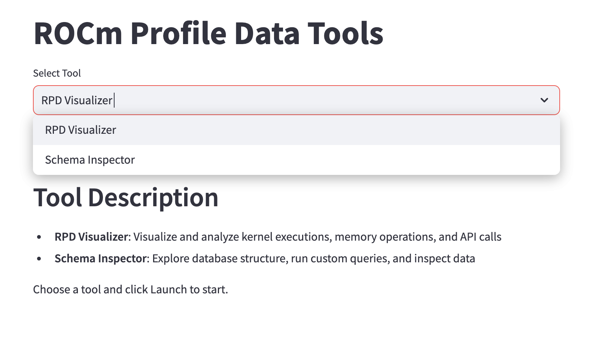
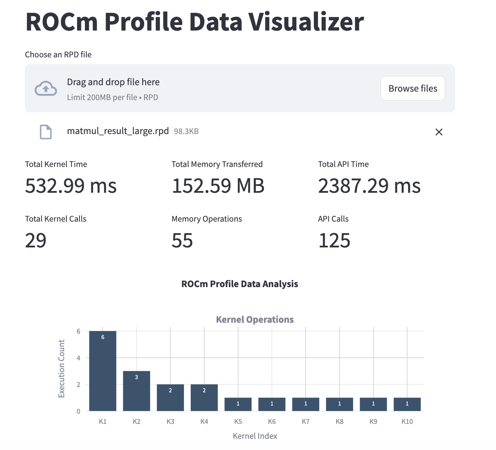
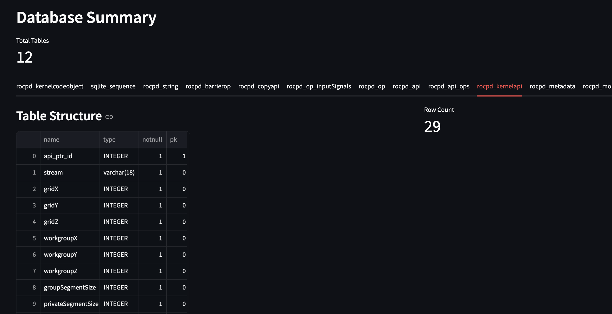

# ROCm Profile Data Visualizer Tools

A suite of interactive visualization and analysis tools for ROCm Profile Data (.rpd) files. This package includes a data visualizer and a schema inspector to help developers analyze ROCm profiling results effectively.

## Tools Included

### 1. RPD Visualizer
- Interactive visualization of kernel executions, memory operations, and API calls
- Summary statistics and performance metrics
- Filterable raw data tables
- Hover-detailed information
- Export capabilities

### 2. Schema Inspector
- Interactive database schema exploration
- Table structure visualization
- Custom SQL query interface
- Sample data viewing
- Schema relationship diagrams

## Prerequisites

- Python 3.8 or higher
- ROCm installed and configured
- pip (Python package installer)

## Installation

1. Clone the repository:

[https://github.com/ROCm/rocmProfileData](https://github.com/ROCm/rocmProfileData)

2. Navigate to the visualizer directory:

cd visualizer

3. Install the required Python packages:

pip install -r requirements.txt

## Usage

### Option 1: Using the Launcher

Select your desired tool from the dropdown menu and click "Launch".

The launcher provides an easy way to switch between:
- RPD Visualizer: For performance analysis and visualization
- Schema Inspector: For database exploration and queries

### Option 2: Direct Tool Launch

## For the visualizer
streamlit run rpd_visualizer.py

## For the schema inspector
streamlit run rpd_schema_check.py

## Features

### RPD Visualizer
- **Kernel Analysis:**
  - Execution count visualization
  - Duration statistics
  - Detailed kernel information
  - Performance metrics

Example visualization:

- **Memory Operations:**
  - Transfer sizes and patterns
  - Operation type distribution
  - Timing analysis
  - Bandwidth utilization

- **API Calls:**
  - Call frequency analysis
  - Duration statistics
  - Call pattern visualization
  - Performance bottleneck identification

### Schema Inspector
- **Database Exploration:**
  - Table structure viewing
  - Column type information
  - Row count statistics
  - Sample data preview

Example interface:

- **Query Interface:**
  - Custom SQL query execution
  - Interactive results viewing
  - Data filtering and sorting
  - Export capabilities

## Data Analysis Capabilities
- Interactive filtering and sorting
- Custom time range selection
- Performance metric calculation
- Data export functionality
- Detailed hover information
- Cross-reference between different operation types

## Contributing
Contributions are welcome! Please feel free to submit a Pull Request.

## License
[Match with ROCm's license]